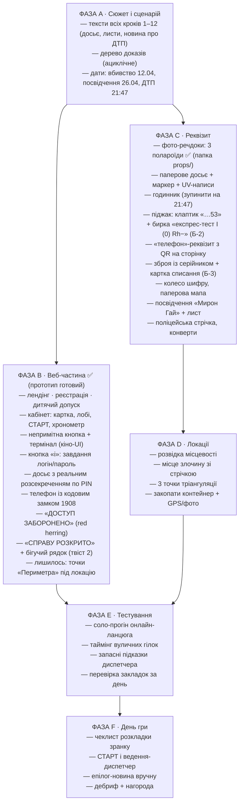
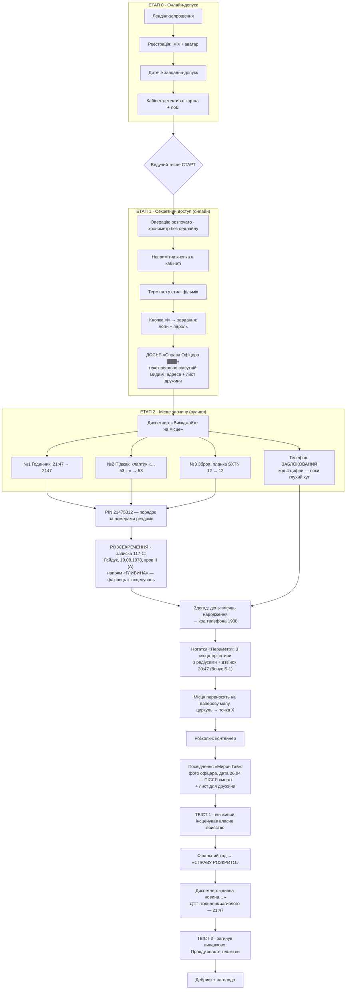

# Детективний клуб — план квесту «Справа офіцера»

> Опрацювання ідей, рекомендації, покроковий сценарій, візуальні карти та відкриті питання.
> Гібридний квест: онлайн (сайт) + на свіжому повітрі.

---

## 1. Вердикт по концепції

Концепція сильна і цілісна. Кістяк: онлайн-допуск → кабінет детектива → секретний термінал → досьє → місце злочину на вулиці → PIN розсекречує досьє → тріангуляція → розкопки → подвійний твіст. Нижче — покроковий сценарій очима учасників, розбір ідей і відкриті питання.

### Зафіксовані рішення

- ✅ Форма реєстрації детективів лишається.
- ✅ Одне завдання для входу до кабінету — **прям дитяче**, це фільтр-ритуал, а не виклик.
- ✅ У кабінеті — **непримітна кнопка «секретний доступ»**, термінал у стилі фільмів (чорний екран, зелений моноширинний шрифт, курсор блимає).
- ✅ Біля терміналу — **кнопка «i»** (як стара Windows-підказка «забули пароль?»): саме там ховаються завдання на логін і пароль.
- ✅ Досьє «Справа Офіцера…» з чорними блоками, де тексту **справді немає** (сервер не віддає текст без PIN) — а не просто замальовано поверх.
- ✅ Зброя — **основний доказ** (речдок № 3): планка «SXTN 12» дає останні дві цифри PIN. Ролі прибрані повністю. Таймера і штрафів немає.

---

## 2. Покроковий сценарій — що бачать учасники

### Крок 1 · Запрошення (лендінг)
Темна сторінка, герб клубу, друкований текст:
> «ДЕТЕКТИВНИЙ КЛУБ. Набір у спецгрупу по справі №003. Розголошення карається. Якщо ви готові — подайте заявку.»
> Кнопка: **[ПОДАТИ ЗАЯВКУ]**

### Крок 2 · Реєстрація детектива
Форма: ім'я + вибір аватарки. Після відправки — «Заявку прийнято. Пройдіть перевірку.»

### Крок 3 · Завдання-допуск (дитяче-дитяче)
Одна загадка рівня дитсадка, наприклад:
> «Що ходить вранці на чотирьох, вдень на двох, а ввечері на трьох?»
Мета — не складність, а ритуал: відповів → штамп **«ДОПУСК НАДАНО»** → двері кабінету відчиняються.

### Крок 4 · Кабінет детектива
Картка детектива (ім'я, аватар, звання «стажер»), лобі: список групи зі статусами «допуск отримано / очікуємо». Ведучий бачить усіх і тисне **[СТАРТ]** → операція розпочинається. Жорсткого таймера немає — на екрані лише хронометр, темп тримає диспетчер.

### Крок 5 · Секретний доступ
Після СТАРТу в кутку кабінету з'являється **непримітна** деталь — маленька іконка замка / ледь помітна крапка в кутку екрана. Хто помітив і клікнув → чорний термінал як у фільмах:
```
SLUZHBA-X SECURE GATEWAY v2.4
> LOGIN: _
> PASSWORD: _
                                   [ i ]
```
Кнопка **[ i ]** (стара добра віндовс-підказка) відкриває «Забули пароль?» — а там два завдання: одне дає **логін**, друге — **пароль**. Це і є «складніше завдання», тепер вбудоване у фікшн терміналу.

### Крок 6 · Досьє «СПРАВА ОФІЦЕРА ▓▓▓▓▓▓»
Після входу відкривається справа:
> «Майор ▓▓▓▓▓▓ ▓▓▓▓▓, 12 квітня, о ▓▓:▓▓ знайдений ▓▓▓▓▓▓▓▓▓▓ … Тіло та документи вивезені ▓▓▓▓▓▓▓▓▓▓▓▓. Свідок: ▓▓▓▓▓▓▓▓. Місце події: **[адреса — видима!]** …»

Чорні блоки — це справжня відсутність тексту (сервер віддає їх лише після PIN). Видимими лишаються рівно ті шматки, що потрібні зараз: **адреса місця злочину** і лист дружини:
> «Поліція закрила справу за тиждень. Ніхто не шукає. Я заплачу́, скільки скажете, — тільки знайдіть, хто це зробив. — О.»

Диспетчер (ведучий у месенджері): «Речові докази досі на місці. Виїжджайте. Зв'язок тримаємо тут.»

### Крок 7 · Вулиця: місце злочину
Локація обгороджена поліцейською стрічкою (вау-момент). Команда ділиться по доказах:
- **Речдок № 1 · Годинник** — зупинився о **21:47** → `2147`
- **Речдок № 2 · Піджак** — у підкладці клаптик «…53…» (крапки з обох боків — середина коду) → `53`
- **Речдок № 3 · Зброя** — планка на рамці **«SXTN 12»** → `12`
- **PIN: `21475312`** (8 цифр). Порядок підказують самі бирки речдоків: № 1 → № 2 → № 3
- **Телефон** — знайдений, але **мертвий**: екран чорний, «ПРИСТРІЙ ЗАШИФРОВАНО». Глухий кут навмисно — доступ до даних з'явиться лише через систему Служби

> Чому телефон більше не дає цифр PIN: на екрані телефона забагато чисел (дата 12.04, час, дзвінок 20:47) — гравці плуталися б, які з них у PIN. Джерела PIN — три чисті артефакти з номерами: годинник, клаптик, планка зброї.

### Крок 8 · Розсекречення
На сторінці досьє (відкривається з телефона прямо на вулиці) — поле:
```
[ РОЗСЕКРЕТИТИ СПРАВУ ]  PIN: _ _ _ _ _ _ _ _
```
Вводять `21475312` → чорні блоки на очах зникають → службова записка № 117-С:
- Майор **Роман Гайдук, 19 серпня 1978 року народження**, група крові II (A) Rh+, псевдонім «Сокіл»
- Історія служби (нова легенда): з 2022-го керівник закритого напряму **«ГЛИБИНА»** — розслідування замахів на людей Служби, легендування, виведення агентів з-під удару; особисто розкрив 11 замахів, жодного нерозкритого; за атестацією — **найкращий у Службі фахівець з розкриття замахів** (форшадовінг делікатніший: хто вміє розкривати постановки — вміє їх і ставити); останнє завдання настільки секретне, що матеріали знищені навіть в архіві; двічі подавав рапорт про загрозу життю — і сам його відкликав
- **Примітка технічного відділу:** службові телефони дзеркалюються у хмару Служби; повна копія пристрою — **СХОВИЩЕ-7** (клікабельне посилання прямо в розсекреченому тексті). Доступ — «за особистим кодом працівника», і це єдина згадка про код: який саме код — гравці здогадуються самі по даті народження

### Крок 8-Б · СХОВИЩЕ-7 (хмарне дзеркало телефона)
Фізичний телефон так і лишається мертвим — але з розсекреченого досьє гравці переходять за посиланням **СХОВИЩЕ-7**: «дзеркало пристрою SLZH-117, синхронізовано 12.04, 21:12». Код — 4 цифри; гравці **самі здогадуються** спробувати дату народження: `19.08` → **1908** (страховка — усна підказка диспетчера). Всередині:
- пропущений дзвінок о 20:47 (за годину до «смерті» — зерно бонус-зачіпки)
- чат: «Вони близько. Роби як домовились» + чернетка «годинник підкаже прав…»
- нотатки **«Периметр»: три місця з радіусами** — не координати, а впізнавані орієнтири (типу «стара церква», «млин»…) — список місць за вами; гравці переносять їх на паперову мапу

### Крок 9 · Тріангуляція та розкопки
Зібрана з фрагментів мапа + циркуль → три кола перетинаються в точці X → копають → **контейнер** (вміст, від доказів до емоцій):
1. **Посвідчення «Служби Х»** на ім'я **Мирон Гай** — фото майора, дата видачі **26.04, через два тижні після «вбивства»** (макети: `props/id-front.png`, `props/id-back.png`)
2. **Фото «proof of life»** ✅ згенеровано: він тримає газету «ВБИВСТВО ОФІЦЕРА. СПРАВУ ЗАКРИТО» від 3 травня 2026 (оригінал: `props/photo-agent-source.png`, у рамці: `props/photo-agent-framed.png`)
3. **Лист Олені** (текст нижче) — емоційне ядро
4. **Жетон «СОКІЛ»** — сувенір-доказ, лишається команді
5. **Ключ без жодного підпису** — нічого не відкриває у цій грі; гачок на «Справу № 004»
6. **«ПОДЯКА АГЕНТСТВА»** — сургучний конверт з нагородою команді (цукерки-«медалі» тощо)

**Лист Олені** — готовий до друку файл: `props/letter.html` (кнопка «Роздрукувати»; вшитий рукописний шрифт Caveat — затверджений; старений папір, лінії згину, слід від чашки) + прев'ю `props/letter.png`. Текст:

> *Олено.*
> *Якщо хтось це читає — значить, він виявився кращим за тих, від кого я ховаюся. Сподіваюсь, це ти.*
> *Вибору не було: або я «помираю», або ми обоє. Я не міг сказати тобі. Пробач.*
> *Не шукай мене. Живи. Все, що лишив, — у місці, про яке знаєш тільки ти.*
> *Годинник не бреше.*
> *Р.*

(«Годинник не бреше» — гачок: на дебрифі зіграє і з бонусом Б-1, і з твістом 2.)

### Крок 10 · ТВІСТ 1
Документ не може існувати, якщо він мертвий: фото його, ім'я нове, дата — після смерті. **Він живий і сам інсценував своє вбивство.** Команда вводить фінальний код (номер посвідчення) в кабінеті → екран **«СПРАВУ РОЗКРИТО. Рейтинг агентства: …»**

### Крок 11 · Епілог і ТВІСТ 2
Через хвилину-дві диспетчер пише: «Дивна новина щойно в стрічці…» + посилання. Сторінка-новина:
> «На трасі ▓▓ загинув невстановлений чоловік. Документів при собі не мав. Годинник на його руці зупинився о **21:47**.»
Гравці згадують годинник з місця злочину — той самий час. Він утік, почав нове життя — і випадково загинув у ДТП. Ні місця, ні мотиву, ні вбивці не існує. **Але правду знаєте тільки ви.**

### Крок 12 · Дебриф
Нагорода агентства, розбір, хто що знайшов, фото біля розкопаного «скарбу».

---

## 3. Відкриті питання (спірне, невирішене, на ваш ОК)

| # | Питання | Стан / пропозиція |
|---|---|---|
| 1 | ~~Підказка про стандарт коду телефона~~ | ✅ ВИРІШЕНО (ваше рішення): підказку з 117-С прибрано — гравці самі здогадуються по даті народження. Страховка: усна підказка диспетчера «а що ми знаємо про власника?» |
| 2 | ~~Порядок цифр PIN~~ | ✅ ВИРІШЕНО (ваше рішення): PIN `21475312` — час → піджак → пістолет. Порядок підказують номери речдоків №1→№2→№3 на бирках полароїдів |
| 3 | ~~Зброя~~ | ✅ ВИРІШЕНО (ваше рішення): зброя — **основний** доказ, планка «SXTN 12» дає останні 2 цифри PIN. Бонус Б-3 (картка списання) при цьому лишається — серійник грає двічі |
| 4 | ~~Ролі~~ | ✅ ВИРІШЕНО (ваше рішення): ролі прибрані повністю — ні механіки, ні бейджів |
| 5 | **Дзвінок о 20:47** | Пропоную зробити частиною бонус-зачіпки Б-1 «час не б'ється», а не просто флейвором. Потребує вашого ОК |
| 6 | ~~Тривалість / таймер~~ | ✅ ВИРІШЕНО (ваше рішення): зворотний відлік і штрафи −10 хв прибрані повністю; у кабінеті хронометр без дедлайну, темп — на ходу |
| 7 | **Відкриті URL екранів.** Допитливий гравець може руками вбити `#/solved` чи `#/denied` | Прохід все одно закритий кодами (фінал вимагає номер посвідчення). Вважаю прийнятним для дружньої гри — але фіксую як відоме обмеження |
| 8 | **Точки тріангуляції** | ✅ Формат вирішено (ваше рішення): це будуть **назви місць** («стара церква» тощо), не координати. Чекаю ваш список 3 місць + радіуси — і підставлю в нотатки телефона |

---

## 4. Аналіз ідей (актуалізований)

### Що працює — лишаємо
- Онлайн-лобі, аватарки, кнопка СТАРТ у ведучого — ритуал і контроль темпу.
- Секретна кнопка + термінал «як у фільмах» — тепер головна онлайн-фішка.
- Досьє зі **справжніми** чорними блоками — краще за замальоване: розсекречення стає ігровою механікою.
- Тріангуляція циркулем — ключ до місця розкопок.
- Закопаний контейнер — кульмінація.
- Псевдо-QR: робочий QR веде на «ДОСТУП ЗАБОРОНЕНО. Спробу зафіксовано» (red herring), справжня зачіпка — контур вирізу; варіант «домалюй QR» — у резерв.
- Годинник 21:47 — цифри PIN **і** форшадовінг Твісту 2.

### Ризики під контролем
1. **Подвійний твіст** — Твіст 2 подається як епілог через диспетчера (новина про ДТП), а годинник заздалегідь показує саме час аварії → ретроспективне «вау» замість «нас обманули».
2. **Дружина** — не знала про інсценування; фінальний лист адресований їй (емоційне закриття).
3. **SAS → «Служба Х»** — вигадана служба розв'язує руки з документами.
4. **Таймер прибрано зовсім** (ваше рішення): жодного зворотного відліку і штрафів — у кабінеті лише хронометр, який фіксує тривалість; темп регулюєте на ходу.
5. **Паперове досьє з маркером** — лишається як фізичний реквізит на вулиці (дублікат онлайн-досьє у «паперовій» версії), щоб UV-написи між рядків мали носій.

---

## 5. Доповнення (ідеї з інтернету, адаптовані)

1. **UV-ліхтарик**: у пакеті доказів; на паперовій копії досьє між рядків UV-написи (дубль-канал до точок тріангуляції — страховка, якщо з PIN щось піде не так).
2. ~~Колесо шифру (Цезар)~~ — **прибрано за вашим рішенням** (робили не раз, людям важко, вирішується останнім).
3. **Мапа шматками**: фрагменти по конвертах на локації; зібрана мапа потрібна для циркуля.
4. **Пароль/фрагменти з прихованим порядком**: порядок склеювання = кількість крапок у куті клаптика.
5. **Диспетчер**: ведучий у месенджері; підказки видає на свій розсуд, без штрафів — його роль тримати темп і настрій.
6. **Баланс типів задач**: візуальні (мапа, QR), текстові (шифр, досьє), логічні (порядок, дати), фізичні (пошук, розкопки).
7. **Контейнер по-геокешерськи**: zip-пакет → бокс → 10–15 см у землю; собі GPS + фото; перевірити за день до гри.
8. **Структура потоку**: онлайн — лінійно; вулиця — 3 паралельні гілки; збіжка в PIN; фінал лінійний. Граф залежностей ациклічний.

### 5-Б. Механіки в резерв (легкі, без шифрів — заміна Цезарю)

1. **Червона лінза**: текст червоним по червоному візерунку — неозброєним оком каша, крізь червоний целофан («лупа детектива») читається. Дешево і завжди «вау».
2. **Дзеркальний текст**: записка віддзеркалена; читається через люстерко або камеру телефона. Нуль підготовки.
3. **Решітка-трафарет (Кардано)**: аркуш з прорізами кладеться на сторінку досьє — у вікнах складається слово. Виглядає як шпигунський артефакт, а рішення механічне, не «математичне».
4. **Нитки-довжини**: 3–4 нитки різних кольорів, довжина кожної в сантиметрах = цифра; лінійка на місці. Тактильно, командно.
5. **Аудіо-зачіпка**: у СХОВИЩІ-7 крім нотаток — «голосове» (запишіть друга): фраза з обмовкою, яку помітять уважні. Дуже дешево, дуже атмосферно.
6. **Два фото «знайди відмінності»**: «фото при огляді» і «фото зараз» тієї ж локації — зникла одна річ; де вона тепер — там закладка.
7. **Фото-пазл**: роздруковане фото розрізане на 12–16 шматків, на звороті зібраного — стрілка/позначка на мапі.

---

## 6. Схема кодів (ланцюг залежностей)

```
ОНЛАЙН (термінал, кнопка «i»):
  Завдання Л → ЛОГІН (СОКІЛ)     Завдання П → ПАРОЛЬ (1947)
  → досьє (видимі шматки: адреса + лист дружини) → виїзд на місце

ВУЛИЦЯ, РІВЕНЬ 1 (докази → PIN розсекречення):
  Речдок №1  Годинник 21:47         → [2][1][4][7]
  Речдок №2  Піджак, клаптик «…53…» → [5][3]
  Речдок №3  Зброя, планка SXTN 12  → [1][2]
                                      ──────────
  PIN: 21475312 (порядок = номери речдоків)
  → чорні блоки зникають → записка 117-С

РОЗСЕКРЕЧЕНЕ ДОСЬЄ → КОД ТЕЛЕФОНА:
  «19 серпня 1978 р.н.» → гравці пробують дату як код: 1908
  → нотатки «Периметр»: 3 точки з радіусами

ВУЛИЦЯ, РІВЕНЬ 2:
  3 місця-орієнтири + паперова мапа + циркуль → точка Х → розкопки → контейнер

ФІНАЛ:
  Номер посвідчення «Мирон Гай» (X-2604) → «СПРАВУ РОЗКРИТО» → бігучий рядок (твіст 2)
```

Кожен код відкриває рівно один наступний крок — граф лінійний після збіжки PIN, без циклів. Жодна зачіпка не лежить «за дверима», які відкриває вона сама.

## 6-Б. Бонус-зачіпки (2–3 приховані знахідки → бонуси на дебрифі)

Ідея: уважні гравці знаходять невідповідності, які натякають на інсценування ще ДО фіналу. Кожна знайдена = +1 зірка рейтингу або приз. Ніщо з цього не блокує проходження — суто нагорода за уважність.

| # | Зачіпка | Як зібрати | Що вона доводить |
|---|---|---|---|
| Б-1 | **Час не б'ється** (ваша ідея: «вбивство сталося раніше») | Пропущений дзвінок о 20:47 + чернетка «годинник підкаже прав…» + годинник рівно о 21:47 | Годинник зупинили вручну, час смерті постановочний |
| Б-2 | **Кров не його** | У 117-С група крові майора II (A) Rh+; на бирці піджака (реквізит) — «експрес-тест: I (0) Rh−» | Кров на піджаку не належить майору |
| Б-3 | **Зброя зі складу Служби** | Планка «SXTN 12» (вона ж джерело цифр PIN) збігається з № у «картці списання» (паперовий реквізит у конверті «АРХІВ», датований 3 роками раніше) | Зброю міг узяти лише свій — жодного «зовнішнього вбивці» |

На дебрифі ведучий питає: «Що ще ви помітили?» — і зараховує знайдене.

---

## 7. Візуальна карта 1 — План робіт



---

## 8. Візуальна карта 2 — Алгоритм проходження



---

## 9. Наступні кроки (веб-частина)

1. Лендінг-запрошення в Детективний клуб.
2. Реєстрація детектива (ім'я + аватар).
3. Дитяче завдання-допуск → кабінет.
4. Кабінет: картка детектива, лобі зі статусами, СТАРТ + таймер.
5. Непримітна кнопка → термінал (кіно-UI) → кнопка «i» з завданнями логін/пароль.
6. Досьє з реальним розсекреченням по PIN.
7. Сторінки: телефон жертви, «ДОСТУП ЗАБОРОНЕНО», «СПРАВУ РОЗКРИТО», новина-епілог.

Стиль: базово «Досьє» (маніла + червоний штамп); термінал і службові екрани — «Нуар»/кіно-термінал.

---

## Джерела ідей

- [Indigo Extra — Murder Mystery Riddles and Clue Ideas](https://www.indigoextra.com/blog/murder-mystery-riddles)
- [How to create your own Murder Mystery Party](https://www.indigoextra.com/blog/how-to-create-murder-mystery-party)
- [In The Playroom — 50 DIY Escape Room Puzzle Ideas](https://intheplayroom.co.uk/50-best-diy-escape-room-puzzle-ideas/)
- [Escape Kit — 20 Escape Room Puzzles & Clues](https://escape-kit.com/en/games/escape-room-puzzles-clues/)
- [Mystery Soup Games — Linear vs. Non-Linear Game Flow](https://mysterysoupgames.com/linear-vs-non-linear-game-flow-in-escape-rooms/)
- [Designing Escape Rooms (FIT CTU lecture, puzzle dependency graphs)](https://courses.fit.cvut.cz/NI-ESC/lectures/files/esc-room-design.pdf)
- [TreasureQuesting — GPS Treasure Hunt Guide](https://treasurequesting.com/blog/gps-treasure-hunt-guide)
- [Adventure Lab (геокешинг-квести з етапами)](https://apps.apple.com/us/app/-/id1412140803)
