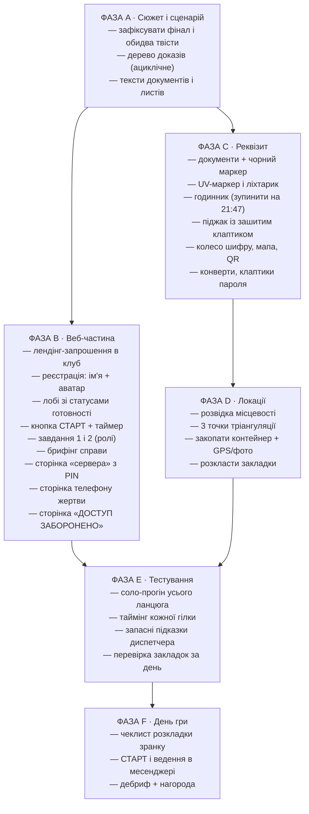
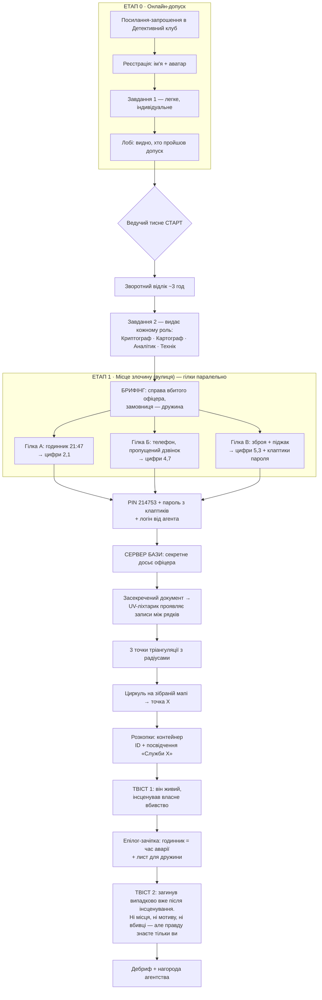

# Детективний клуб — план квесту «Справа офіцера»

> Опрацювання ідей, рекомендації, візуальна карта плану робіт та алгоритм проходження.
> Гібридний квест: онлайн (сайт) + на свіжому повітрі.

---

## 1. Вердикт по концепції

Концепція сильна і цілісна: онлайн-допуск створює передчуття, вулична частина дає фізику й азарт, а подвійний твіст — літературний фінал. Кістяк міняти не треба. Нижче — що підсилити, що виправити і що прибрати.

---

## 2. Аналіз ваших ідей

### Що працює відмінно (залишаємо як є)

| Ідея | Чому це добре |
|---|---|
| Онлайн-лобі: реєстрація, аватарки, видно хто готовий, кнопка СТАРТ у ведучого | Ритуал «допуску до справи» — гравці відчувають офіційність ще до старту. Плюс вам зручно керувати темпом |
| Засекречені документи (А4, чорний маркер) | Дешево, миттєво атмосферно. Класика жанру |
| Тріангуляція: 3 стовпчики з радіусами + циркуль на мапі | Найкраща задачка сценарію: фізична, командна, унікальна. Її треба зробити **ключем до місця закопаних документів** |
| Реально закопані документи | Кульмінація, яку запам'ятають. Мало хто з квестів дає «справжній скарб» |
| Псевдо-QR (QR як підложка під вирізану задачку) | Свіжа ідея з подвійним дном — див. розвиток нижче |
| Годинник, що зупинився | Класика; прив'язати цифри до PIN-коду і до фінального твісту (див. нижче) |

### Ризики та що виправити

1. **Подвійний твіст — головний ризик сценарію.** «Він живий і сам інсценував» — сильний фінал. Але другий твіст («насправді випадково загинув, тож ні місця, ні мотиву, ні вбивці не існує») може *знецінити* перший і лишити відчуття «нас обманули», якщо його не підготувати. Рішення:
   - Зробити другий твіст **епілогом-післясмаком**: маленька зачіпка знаходиться вже ПІСЛЯ того, як команда «перемогла» (розкрила інсценування).
   - Обов'язковий ранній форшадовінг (рушниця Чехова): **годинник зупинився саме на часі нещасного випадку** — гравці зрозуміють це ретроспективно і отримають «вау» замість «що це було».
   - Емоційне закриття: у контейнері лежить лист «якщо ви це читаєте — передайте дружині…». Тоді фінал не «нічого не існує», а «ми єдині, хто дізнався правду».
2. **Дірка в логіці: дружина-замовниця.** Якщо офіцер сам інсценував смерть — чи знала дружина? Два варіанти закрити: (а) вона не знала, і фінальний лист адресований їй — емоційніше; (б) вона знала і найняла вас, щоб «легалізувати» смерть — цинічніше, детективніше. Рекомендую (а).
3. **Друге індивідуальне завдання після старту таймера.** Хто впорається швидко — нудьгує, хто застряг — палить командний час. Рішення: зробити завдання 2 таким, що **видає кожному роль** (Криптограф, Картограф, Аналітик, Технік) — тоді і чекання виправдане сюжетно, і кожен отримує «свій» інструмент на вуличну частину.
4. **Докази не повинні бути декорацією.** Правило ескейп-румів: кожен предмет або дає зачіпку, або явно позначений як антураж. Зараз піджак і зброя «просто лежать». Виправлення: піджак — у підкладці зашитий клаптик з фрагментом пароля; зброя — серійний номер дає 2 цифри PIN.
5. **SAS.** SAS — британська спецслужба. Або дати офіцеру британський слід у біографії, або замінити на вигадану «Службу Х» (розв'язує руки: не треба реалізму, можна вигадувати документи як завгодно). Друге простіше і безпечніше по сюжету.
6. **2 години — впритул.** Для обсягу «онлайн-пролог + 3 гілки доказів + сервер + тріангуляція + розкопки» реалістично 2.5–3 години. Або збільшити таймер, або зробити його «м'яким»: після нуля гра триває, але «рейтинг агентства» падає.

### Що лишнє / спростити

- **Не робіть 2 окремі «складні» онлайн-задачі до брифінгу** — одна легка на реєстрації + одна рольова після старту. Все інше — на вулицю.
- **«Знаряддя вбивства» як окремий доказ** — якщо це реквізит заради реквізиту, він конкурує з годинником/телефоном. Або дайте йому серійний номер (цифри PIN), або приберіть — менше реквізиту, більше щільності.
- **Не перевантажуйте телефон жертви**: одна HTML-сторінка, 3 зачіпки максимум (чат, пропущений дзвінок, нотатка). Більше — гравці загрузнуть.

---

## 3. Доповнення (ідеї з інтернету, адаптовані під ваш сюжет)

1. **UV-ліхтарик + невидимі чорнила.** У «пакеті доказів» лежить UV-ліхтарик без пояснень. На засекреченому документі **між рядків** — написи UV-маркером (координатна сітка або назви 3 точок тріангуляції). Подвійне дно: документ, який вже «прочитали», доводиться діставати знову.
2. **Шифрувальне колесо (Цезар).** Щоденник/записка жертви зашифрована зсувом літер; **число зсуву = цифра з годинника**. Колесо-дешифратор роздрукувати як фірмовий «інструмент агентства» — красивий роздатковий реквізит.
3. **Мапа, розрізана на шматки.** Фрагменти мапи місцевості розкладені по локаціях/конвертах; зібрана мапа потрібна для тріангуляції, а на звороті зібраного полотна — намальована половинка QR (див. п. 5).
4. **Пароль на листочках з прихованим порядком.** Фрагменти пароля в різних місцях; порядок склеювання захований у дрібниці (кількість крапок у куті кожного клаптика). Без порядку пароль не збирається — і це окреме «ага!».
5. **Розвиток псевдо-QR.** Два варіанти, можна обидва:
   - QR, що сканується, веде на сторінку **«ДОСТУП ЗАБОРОНЕНО. Спроба зафіксована»** — красивий red herring, а справжня зачіпка — сам контур вирізу поверх QR.
   - **Домалюй QR**: роздрукований QR з відсутнім кутом; відсутній шматок гравці знаходять/домальовують за сіткою з іншої задачі — тільки тоді він сканується і відкриває сторінку сервера.
6. **Телефон жертви (HTML-сторінка).** Локскрін з останніми повідомленнями: обірваний чат («Вони близько. Роби як домовились»), **пропущений дзвінок о ЧЧ:ХХ** (2 цифри PIN), нотатка з обірваними координатами. Рівень заряду теж може бути цифрою.
7. **Диспетчер і підказки.** Ведучий у месенджері — «Диспетчер Агентства». 3 підказки на гру, кожна коштує −10 хв рейтингу (не часу — щоб не вбивати темп). Тримає вас у грі й дає важіль, якщо команда застрягла.
8. **Задачі під різні типи гравців.** Перевірити баланс: візуальні (мапа, QR), текстові (шифр, документи), логічні (порядок фрагментів), фізичні (розкопки, пошук точок). Кожен гравець має хоч раз «затащити».
9. **Контейнер по-геокешерськи.** Документи в zip-пакеті → пластиковий бокс → закопати неглибоко (10–15 см). Собі: GPS-точка + фото місця. Перевірити за день до гри, що закладка на місці.
10. **Гібридна структура потоку** (стандарт дизайну ескейп-румів): пролог лінійний → вулична частина **3 паралельні гілки** (команда ділиться, ніхто не простоює) → збіжка у PIN → лінійний фінал. Граф залежностей має бути ациклічним: жодна зачіпка не лежить «за дверима», які відкриває вона сама.

---

## 4. Схема збирання PIN-коду

```
Гілка А: Годинник        → зупинився о 21:47 → цифри [2][1]  (і час аварії — форшадовінг твісту 2)
Гілка Б: Телефон         → пропущений о __:47 → цифри [4][7]
Гілка В: Зброя/піджак    → серійний № ...53   → цифри [5][3]
                                                ─────────────
PIN сервера: 214753   +   Пароль: зібраний з клаптиків (порядок = крапки)
Логін: «вкрав наш агент» → видається на сайті після завдання 2
```

---

## 5. Візуальна карта 1 — План робіт



---

## 6. Візуальна карта 2 — Алгоритм проходження квесту



---

## 7. Наступні кроки (з вашого ТЗ до Claude Code)

1. Початкова сторінка — запрошення в Детективний клуб.
2. Форма входу (ім'я + аватар) і лобі зі статусами.
3. Два тестові завдання (легке + рольове).
4. Тестовий зворотний відлік з кнопкою СТАРТ у ведучого.
5. Вивід тексту основного завдання (брифінг).
6. Сторінки «сервер бази» (PIN + логін/пароль), «телефон жертви», «ДОСТУП ЗАБОРОНЕНО».

---

## Джерела ідей

- [Indigo Extra — Murder Mystery Riddles and Clue Ideas](https://www.indigoextra.com/blog/murder-mystery-riddles)
- [How to create your own Murder Mystery Party](https://www.indigoextra.com/blog/how-to-create-murder-mystery-party)
- [In The Playroom — 50 DIY Escape Room Puzzle Ideas](https://intheplayroom.co.uk/50-best-diy-escape-room-puzzle-ideas/)
- [Escape Kit — 20 Escape Room Puzzles & Clues](https://escape-kit.com/en/games/escape-room-puzzles-clues/)
- [Mystery Soup Games — Linear vs. Non-Linear Game Flow](https://mysterysoupgames.com/linear-vs-non-linear-game-flow-in-escape-rooms/)
- [Designing Escape Rooms (FIT CTU lecture, puzzle dependency graphs)](https://courses.fit.cvut.cz/NI-ESC/lectures/files/esc-room-design.pdf)
- [TreasureQuesting — GPS Treasure Hunt Guide](https://treasurequesting.com/blog/gps-treasure-hunt-guide)
- [Adventure Lab (геокешинг-квести з етапами)](https://apps.apple.com/us/app/-/id1412140803)
