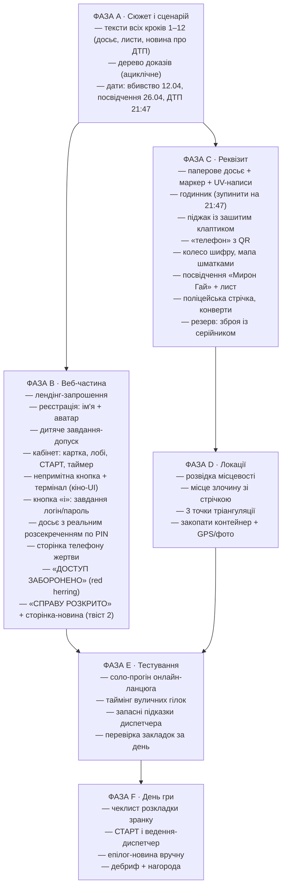
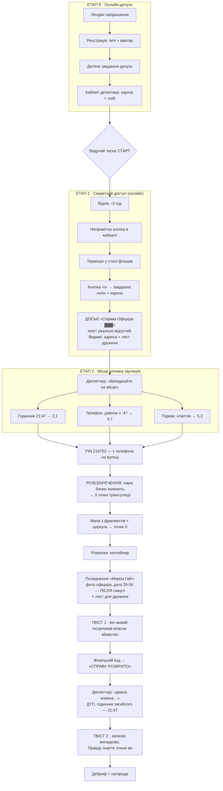

# Детективний клуб — план квесту «Справа офіцера»

> Опрацювання ідей, рекомендації, покроковий сценарій, візуальні карти та відкриті питання.
> Гібридний квест: онлайн (сайт) + на свіжому повітрі.

---

## 1. Вердикт по концепції

Концепція сильна і цілісна. Кістяк: онлайн-допуск → кабінет детектива → секретний термінал → досьє → місце злочину на вулиці → PIN розсекречує досьє → тріангуляція → розкопки → подвійний твіст. Нижче — покроковий сценарій очима учасників, розбір ідей і відкриті питання.

### Зафіксовані рішення

- ✅ Форма реєстрації детективів лишається.
- ✅ Одне завдання для входу до кабінету — **прям дитяче**, це фільтр-ритуал, а не виклик.
- ✅ У кабінеті — **непримітна кнопка «секретний доступ»**, термінал у стилі фільмів (чорний екран, зелений моноширинний шрифт, курсор блимає).
- ✅ Біля терміналу — **кнопка «i»** (як стара Windows-підказка «забули пароль?»): саме там ховаються завдання на логін і пароль.
- ✅ Досьє «Справа Офіцера…» з чорними блоками, де тексту **справді немає** (сервер не віддає текст без PIN) — а не просто замальовано поверх.
- ✅ Знаряддя вбивства — **у резерв** (якщо повернеться: серійний номер = запасні 2 цифри PIN).

---

## 2. Покроковий сценарій — що бачать учасники

### Крок 1 · Запрошення (лендінг)
Темна сторінка, герб клубу, друкований текст:
> «ДЕТЕКТИВНИЙ КЛУБ. Набір у спецгрупу по справі №003. Розголошення карається. Якщо ви готові — подайте заявку.»
> Кнопка: **[ПОДАТИ ЗАЯВКУ]**

### Крок 2 · Реєстрація детектива
Форма: ім'я + вибір аватарки. Після відправки — «Заявку прийнято. Пройдіть перевірку.»

### Крок 3 · Завдання-допуск (дитяче-дитяче)
Одна загадка рівня дитсадка, наприклад:
> «Що ходить вранці на чотирьох, вдень на двох, а ввечері на трьох?»
Мета — не складність, а ритуал: відповів → штамп **«ДОПУСК НАДАНО»** → двері кабінету відчиняються.

### Крок 4 · Кабінет детектива
Картка детектива (ім'я, аватар, звання «стажер»), лобі: список групи зі статусами «допуск отримано / очікуємо». Ведучий бачить усіх і тисне **[СТАРТ]** → на екранах у всіх запускається зворотний відлік (~3 год).

### Крок 5 · Секретний доступ
Після СТАРТу в кутку кабінету з'являється **непримітна** деталь — маленька іконка замка / ледь помітна крапка в кутку екрана. Хто помітив і клікнув → чорний термінал як у фільмах:
```
SLUZHBA-X SECURE GATEWAY v2.4
> LOGIN: _
> PASSWORD: _
                                   [ i ]
```
Кнопка **[ i ]** (стара добра віндовс-підказка) відкриває «Забули пароль?» — а там два завдання: одне дає **логін**, друге — **пароль**. Це і є «складніше завдання», тепер вбудоване у фікшн терміналу.

### Крок 6 · Досьє «СПРАВА ОФІЦЕРА ▓▓▓▓▓▓»
Після входу відкривається справа:
> «Майор ▓▓▓▓▓▓ ▓▓▓▓▓, 12 квітня, о ▓▓:▓▓ знайдений ▓▓▓▓▓▓▓▓▓▓ … Тіло та документи вивезені ▓▓▓▓▓▓▓▓▓▓▓▓. Свідок: ▓▓▓▓▓▓▓▓. Місце події: **[адреса — видима!]** …»

Чорні блоки — це справжня відсутність тексту (сервер віддає їх лише після PIN). Видимими лишаються рівно ті шматки, що потрібні зараз: **адреса місця злочину** і лист дружини:
> «Поліція закрила справу за тиждень. Ніхто не шукає. Я заплачу́, скільки скажете, — тільки знайдіть, хто це зробив. — О.»

Диспетчер (ведучий у месенджері): «Речові докази досі на місці. Виїжджайте. Зв'язок тримаємо тут.»

### Крок 7 · Вулиця: місце злочину
Локація обгороджена поліцейською стрічкою (вау-момент). Команда ділиться по доказах:
- **Годинник** — зупинився о 21:47 → цифри `2` `1`
- **Телефон** (HTML-сторінка за QR на «телефоні»): обірваний чат «Вони близько. Роби як домовились», пропущений дзвінок о __:47 → цифри `4` `7`, нотатка з обірваними координатами
- **Піджак у крові** — у підкладці зашитий клаптик → цифри `5` `3` (+ фрагменти, якщо пароль винесемо на вулицю)

### Крок 8 · Розсекречення
На сторінці досьє (відкривається з телефона прямо на вулиці) — поле:
```
[ РОЗСЕКРЕТИТИ СПРАВУ ]  PIN: _ _ _ _ _ _
```
Вводять `214753` → чорні блоки на очах зникають, з'являється прихований текст: службова записка з **трьома точками** (стовпчики для стрічки) та радіусами.

### Крок 9 · Тріангуляція та розкопки
Зібрана з фрагментів мапа + циркуль → три кола перетинаються в точці X → копають → **контейнер**:
- посвідчення «Служби Х» на ім'я **Мирон Гай** — але фото майора; дата видачі — **26 квітня, через два тижні після «вбивства»**;
- лист, написаний його рукою: «Якщо ви це знайшли — значить, ви кращі, ніж ті, від кого я ховався. Передайте Олені: пробач. Так було треба.»

### Крок 10 · ТВІСТ 1
Документ не може існувати, якщо він мертвий: фото його, ім'я нове, дата — після смерті. **Він живий і сам інсценував своє вбивство.** Команда вводить фінальний код (номер посвідчення) в кабінеті → екран **«СПРАВУ РОЗКРИТО. Рейтинг агентства: …»**

### Крок 11 · Епілог і ТВІСТ 2
Через хвилину-дві диспетчер пише: «Дивна новина щойно в стрічці…» + посилання. Сторінка-новина:
> «На трасі ▓▓ загинув невстановлений чоловік. Документів при собі не мав. Годинник на його руці зупинився о **21:47**.»
Гравці згадують годинник з місця злочину — той самий час. Він утік, почав нове життя — і випадково загинув у ДТП. Ні місця, ні мотиву, ні вбивці не існує. **Але правду знаєте тільки ви.**

### Крок 12 · Дебриф
Нагорода агентства, розбір, хто що знайшов, фото біля розкопаного «скарбу».

---

## 3. Відкриті питання (і мої пропозиції)

| # | Питання | Пропозиція | Статус |
|---|---|---|---|
| 1 | Як після отримання досьє винести гру на вулицю? | Досьє = міст: у видимій частині — адреса місця злочину, диспетчер командує «виїжджайте». А PIN, знайдений на вулиці, розсекречує решту досьє з телефона — онлайн і вулиця зшиті в обидва боки | Рішення запропоноване — чекає вашого ОК |
| 2 | Як від розкопаних речей перейти до Твісту 1 «він живий»? | Посвідчення з його фото, чужим ім'ям і датою видачі **після** дати вбивства — документ мертвого існувати не може. Підсилення: почерк листа збігається з щоденником/нотаткою з телефону | Рішення запропоноване — чекає вашого ОК |
| 3 | Логіка ролей: атмосфера чи перевантаження? | Чесно: механіка під ролі — перевантаження. Рекомендую лишити роль як **косметичний бейдж** у кабінеті (звання/позивний на картці детектива) — нуль правил, чистий вайб. Або прибрати зовсім | Ваш вибір: бейдж / прибрати |
| 4 | Знаряддя вбивства | У резерв. Якщо повертаємо — серійний номер дає запасні 2 цифри PIN (страховка, якщо якась гілка на вулиці зірветься — дощ, загублена закладка) | Зарезервовано |

---

## 4. Аналіз ідей (актуалізований)

### Що працює — лишаємо
- Онлайн-лобі, аватарки, кнопка СТАРТ у ведучого — ритуал і контроль темпу.
- Секретна кнопка + термінал «як у фільмах» — тепер головна онлайн-фішка.
- Досьє зі **справжніми** чорними блоками — краще за замальоване: розсекречення стає ігровою механікою.
- Тріангуляція циркулем — ключ до місця розкопок.
- Закопаний контейнер — кульмінація.
- Псевдо-QR: робочий QR веде на «ДОСТУП ЗАБОРОНЕНО. Спробу зафіксовано» (red herring), справжня зачіпка — контур вирізу; варіант «домалюй QR» — у резерв.
- Годинник 21:47 — цифри PIN **і** форшадовінг Твісту 2.

### Ризики під контролем
1. **Подвійний твіст** — Твіст 2 подається як епілог через диспетчера (новина про ДТП), а годинник заздалегідь показує саме час аварії → ретроспективне «вау» замість «нас обманули».
2. **Дружина** — не знала про інсценування; фінальний лист адресований їй (емоційне закриття).
3. **SAS → «Служба Х»** — вигадана служба розв'язує руки з документами.
4. **Таймер** — ~3 год або м'який: після нуля гра триває, падає «рейтинг агентства».
5. **Паперове досьє з маркером** — лишається як фізичний реквізит на вулиці (дублікат онлайн-досьє у «паперовій» версії), щоб UV-написи між рядків мали носій.

---

## 5. Доповнення (ідеї з інтернету, адаптовані)

1. **UV-ліхтарик**: у пакеті доказів; на паперовій копії досьє між рядків UV-написи (дубль-канал до точок тріангуляції — страховка, якщо з PIN щось піде не так).
2. **Колесо шифру (Цезар)**: записка жертви зашифрована зсувом; зсув = цифра з годинника. Колесо — фірмовий «інструмент агентства».
3. **Мапа шматками**: фрагменти по конвертах на локації; зібрана мапа потрібна для циркуля.
4. **Пароль/фрагменти з прихованим порядком**: порядок склеювання = кількість крапок у куті клаптика.
5. **Диспетчер**: ведучий у месенджері; 3 підказки на гру, кожна −10 хв «рейтингу» (не часу).
6. **Баланс типів задач**: візуальні (мапа, QR), текстові (шифр, досьє), логічні (порядок, дати), фізичні (пошук, розкопки).
7. **Контейнер по-геокешерськи**: zip-пакет → бокс → 10–15 см у землю; собі GPS + фото; перевірити за день до гри.
8. **Структура потоку**: онлайн — лінійно; вулиця — 3 паралельні гілки; збіжка в PIN; фінал лінійний. Граф залежностей ациклічний.

---

## 6. Схема кодів

```
ОНЛАЙН (термінал, кнопка «i»):
  Завдання А → ЛОГІН        Завдання Б → ПАРОЛЬ
  → відкривається досьє (видимі шматки: адреса + лист дружини)

ВУЛИЦЯ (докази → PIN розсекречення):
  Годинник   21:47          → [2][1]   (= час майбутньої аварії — форшадовінг)
  Телефон    пропущений :47 → [4][7]
  Піджак     клаптик        → [5][3]
                              ────────
  PIN: 214753 → чорні блоки зникають → точки тріангуляції

ФІНАЛ:
  Номер посвідчення «Мирон Гай» → код завершення → «СПРАВУ РОЗКРИТО»
  Резерв: серійний № зброї → запасні цифри, якщо гілка зірветься
```

---

## 7. Візуальна карта 1 — План робіт



---

## 8. Візуальна карта 2 — Алгоритм проходження



---

## 9. Наступні кроки (веб-частина)

1. Лендінг-запрошення в Детективний клуб.
2. Реєстрація детектива (ім'я + аватар).
3. Дитяче завдання-допуск → кабінет.
4. Кабінет: картка детектива, лобі зі статусами, СТАРТ + таймер.
5. Непримітна кнопка → термінал (кіно-UI) → кнопка «i» з завданнями логін/пароль.
6. Досьє з реальним розсекреченням по PIN.
7. Сторінки: телефон жертви, «ДОСТУП ЗАБОРОНЕНО», «СПРАВУ РОЗКРИТО», новина-епілог.

Стиль: базово «Досьє» (маніла + червоний штамп); термінал і службові екрани — «Нуар»/кіно-термінал.

---

## Джерела ідей

- [Indigo Extra — Murder Mystery Riddles and Clue Ideas](https://www.indigoextra.com/blog/murder-mystery-riddles)
- [How to create your own Murder Mystery Party](https://www.indigoextra.com/blog/how-to-create-murder-mystery-party)
- [In The Playroom — 50 DIY Escape Room Puzzle Ideas](https://intheplayroom.co.uk/50-best-diy-escape-room-puzzle-ideas/)
- [Escape Kit — 20 Escape Room Puzzles & Clues](https://escape-kit.com/en/games/escape-room-puzzles-clues/)
- [Mystery Soup Games — Linear vs. Non-Linear Game Flow](https://mysterysoupgames.com/linear-vs-non-linear-game-flow-in-escape-rooms/)
- [Designing Escape Rooms (FIT CTU lecture, puzzle dependency graphs)](https://courses.fit.cvut.cz/NI-ESC/lectures/files/esc-room-design.pdf)
- [TreasureQuesting — GPS Treasure Hunt Guide](https://treasurequesting.com/blog/gps-treasure-hunt-guide)
- [Adventure Lab (геокешинг-квести з етапами)](https://apps.apple.com/us/app/-/id1412140803)
